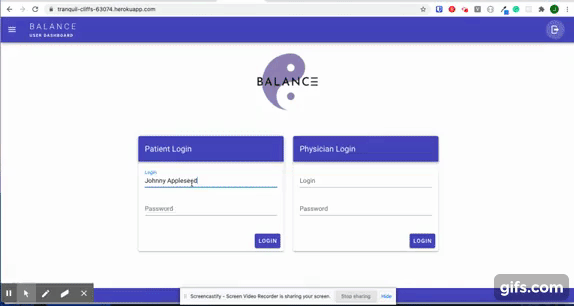
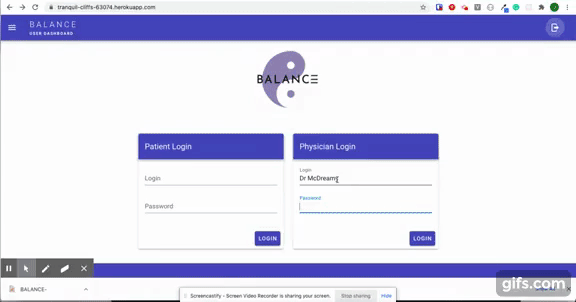

# BALANCE-VUE


* [BALANCE-VUE - Git Hub](https://github.com/dvega920/BALANCE)
* [BALANCE-VUE - Heroku](https://tranquil-cliffs-63074.herokuapp.com/)
* [BALANCE-VUE - Demo Video](https://drive.google.com/file/d/1EUd0oUYkT08TKnxjbmqPDJ901ri62zKI/view)

Patient Portal View: 



Provider Portal View: 




### To Demonstrate App
> Open deployed link in browser


## Summary

Balance is a website designed to integrate communication between mental health service providers and clients. This was built using Vue.js, Material CSS, MongoDB, Express, and, Node.

How it works: 

* VUE JS compiles components to create a comprehensive website for both physician and patient to manage mental health.
* This project emphasizes the use of VUE JS, custom API, and Sequelize Database
* This project utilizes the use of npm packages: Sequelize and express
* This project utilizes the use of Sequelize Seeders to populate database

### This project has the following features: 
* Components for: 
    * Navigation Management
    * Log in for patient and physician
    * Individual dashboards for patient and physician
    * Data summary for physicians view and patient view
    * Contact Us page
    * Physician Profile
    * Patient Profile
    * Questionaire for patient
    * Survey results page for physician

### Psuedo code:  
## Application Requirements
* Must use MERN stack
* Must use a CSS framework other than Bootstrap

### This project has Models for:
* Patient Database
* Physician Database

### This project features responsive design
### Has responsive layout for: 
* Small devices (landscape phones, 576px and up)
* Medium devices (tablets, 768px and up)
* Large devices (desktops, 992px and up)
* Extra large devices (large desktops, 1200px and up)
* Foundation Media Query for 40em


## Getting Started

This app requires custom configuration while using Vue.js. 

Customize configuration: 

See [Configuration Reference](https://cli.vuejs.org/config/).

### Prerequisites

The repository must be cloned, and npm dependencies installed. 

## Project setup
```
npm install
```

### Compiles and hot-reloads for development
```
npm run serve
```

### Compiles and minifies for production
```
npm run build
```

### Lints and fixes files
```
npm run lint
```
## Authors

This group project was created by the following: 

* **Jamie Rachael Morris**  - Back End Management - [Git Hub Profile](https://github.com/jamierachael)
* David Vega - Team Lead
* Mandolin Foster - Content Creator
* Adam Toomey - Front End Design
* UNH Project Design

## Acknowledgments

* Hat tip to UNH for providing project parameters and code examples


